<h1 align="center">
  &nbsp;
  CodeIsland
</h1>

<p align="center">
  <b>Your AI coding agents, live in the MacBook notch.</b><br>
  See what every agent is doing, approve tool calls and answer its questions — without leaving the window you're in.
</p>

<p align="center">
  <a href="https://github.com/wxtsky/CodeIsland/releases/latest"></a>
  <a href="https://github.com/wxtsky/CodeIsland/releases"></a>
  
  <a href="https://apps.apple.com/us/app/code-island-buddy/id6773881129"></a>
  <a href="LICENSE"></a>
  <a href="https://github.com/wxtsky/CodeIsland/stargazers"></a>
</p>

<p align="center">
  <a href="#installation">Install</a> •
  <a href="#highlights">Highlights</a> •
  <a href="#supported-tools">Supported tools</a> •
  <a href="#how-it-works">How it works</a> •
  <a href="#build-from-source">Build</a>
  <br>
  <b>English</b> | <a href="README.zh-CN.md">简体中文</a>
</p>

<p align="center">
  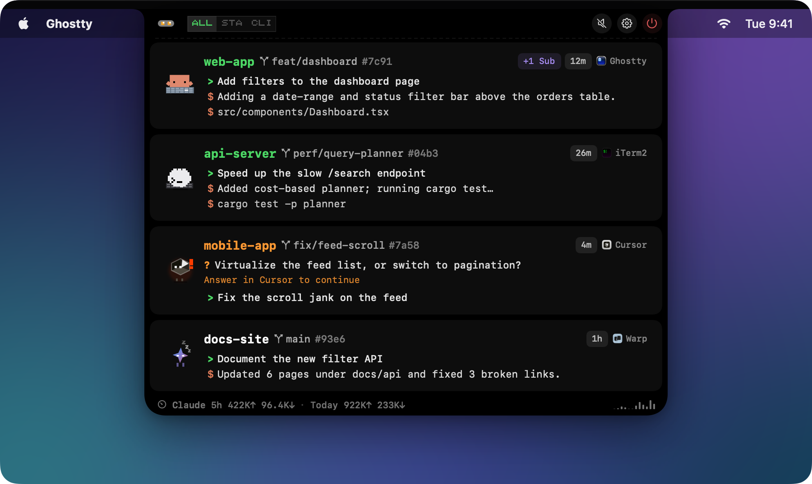
</p>

## Why CodeIsland?

Coding agents spend a lot of time either working or waiting on you — and you only find out by switching to their window. CodeIsland turns the notch into a live status bar for all of them: which session is thinking, which one needs an approval, which one just finished. Approve the tool call or answer the question right there, or click once to jump to the exact terminal tab.

It works with **30+ AI coding tools**, installs its hooks for you, and keeps everything on your Mac.

## Highlights

<table>
<tr>
<td width="50%" valign="top">

**👀 See everything at a glance**

- Live status, current tool and latest reply for every session
- Git branch and worktree on each card; group sessions by project or tool
- Claude usage stats, plus opt-in plan limits (5-hour and weekly)
- A pixel-art mascot per tool, animated by what the agent is doing

</td>
<td width="50%" valign="top">

**✋ Act without switching windows**

- Approve, deny or always-allow tool calls; answer multi-question prompts
- One click to the exact terminal tab, IDE window, or tmux / zellij / Herdr pane
- Global shortcuts for approve, deny, skip and jump
- Auto-proceed for agents you already run in YOLO / Turbo mode

</td>
</tr>
<tr>
<td width="50%" valign="top">

**🧘 Stays out of your way**

- Smart suppress: no ping while you're already looking at that session's tab
- Quiet hours, per-event 8-bit sounds, a "glance dot" completion mode
- Hides in full screen, steps around menu-bar icons, adjustable open/close speed
- Silence rules for directories you never want to hear about

</td>
<td width="50%" valign="top">

**🌐 Beyond this Mac**

- SSH remote hosts — server sessions show up next to local ones
- iPhone & Apple Watch Buddy: Dynamic Island, Lock Screen, StandBy
- An ESP32 desk buddy over Bluetooth
- Webhook forwarding to DingTalk / Lark / Slack
- 7 UI languages; signed, notarized, auto-updating

</td>
</tr>
</table>

<p align="center">
  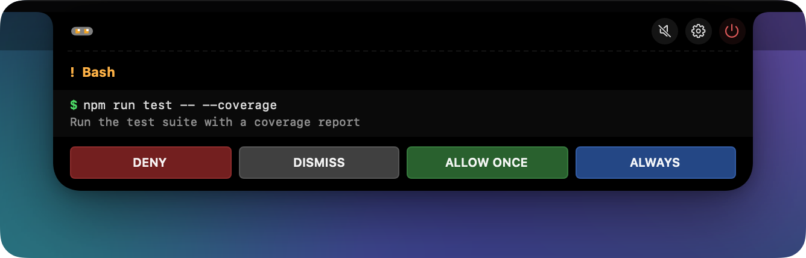<br>
  <sub>Approve a tool call without leaving your editor…</sub>
</p>
<p align="center">
  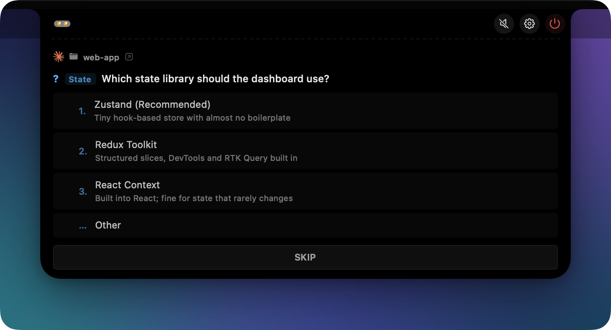<br>
  <sub>…or answer the agent's question right in the notch.</sub>
</p>

## Supported tools

<table>
<tr>
<td align="center" width="16%">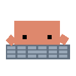<br><sub><b>Claude Code</b></sub></td>
<td align="center" width="16%"><br><sub><b>Codex</b></sub></td>
<td align="center" width="16%"><br><sub><b>Gemini CLI</b></sub></td>
<td align="center" width="16%">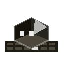<br><sub><b>Cursor</b></sub></td>
<td align="center" width="16%"><br><sub><b>Grok CLI</b></sub></td>
<td align="center" width="16%"><br><sub><b>OpenCode</b></sub></td>
</tr>
<tr>
<td align="center"><br><sub><b>Qoder</b></sub></td>
<td align="center"><br><sub><b>Trae</b></sub></td>
<td align="center">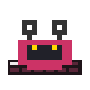<br><sub><b>Copilot CLI</b></sub></td>
<td align="center">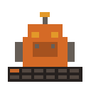<br><sub><b>Factory Droid</b></sub></td>
<td align="center">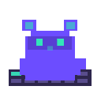<br><sub><b>CodeBuddy</b></sub></td>
<td align="center">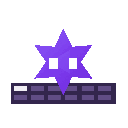<br><sub><b>Qwen Code</b></sub></td>
</tr>
<tr>
<td align="center">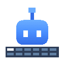<br><sub><b>Kimi Code CLI</b></sub></td>
<td align="center">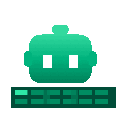<br><sub><b>Cline</b></sub></td>
<td align="center">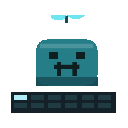<br><sub><b>Pi / Oh My Pi</b></sub></td>
<td align="center"><br><sub><b>Hermes</b></sub></td>
<td align="center"><br><sub><b>OpenClaw</b></sub></td>
<td align="center"><br><sub><b>Google Antigravity</b></sub></td>
</tr>
<tr>
<td align="center"><br><sub><b>Kiro CLI</b></sub></td>
<td align="center">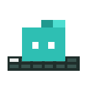<br><sub><b>StepFun</b></sub></td>
<td align="center">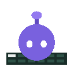<br><sub><b>WorkBuddy</b></sub></td>
<td align="center"><br><sub><b>DeepSeek Harness</b></sub></td>
<td align="center">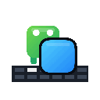<br><sub><b>AiWork</b></sub></td>
<td align="center"><sub><b>+ more</b><br>see below ↓</sub></td>
</tr>
</table>

**Also covered:** Trae CN, Trae CLI / Trae CLI Next, Qoder CN, QoderWork and Qoder CLI, Cursor CLI, CodeBuddy CN, Claude Desktop (Code tab), ZCode — plus any tool with Claude-style hooks, added as a **custom CLI** in Settings → Hooks.

**Knows where it runs:** sessions inside **tmux**, **zellij**, **Herdr** or **T3 Code** get a chip next to the terminal badge, and click-to-jump goes to the right pane or thread.

**Approvals & questions** can be answered from the island for tools whose hooks wait for a decision — Claude Code, Codex, Gemini CLI, Qoder, Qwen Code, Trae CLI Next, ZCode, OpenCode, Pi / Oh My Pi, DeepSeek Harness and others. Tools whose hooks can't carry a decision (Google Antigravity, AiWork) are shown read-only, and approvals stay in their own UI.

<details>
<summary><b>Where each integration is installed</b></summary>

<br>

CodeIsland writes these for you on launch (and repairs them if they drift); each can be switched off in **Settings → Hooks**.

| Tool | Installed into |
|------|----------------|
| Claude Code | `~/.claude/settings.json` (honours `$CLAUDE_CONFIG_DIR`) |
| Codex | `~/.codex/hooks.json` — [needs a one-time review](#codex) |
| Gemini CLI | `~/.gemini/settings.json` |
| Google Antigravity | `~/.gemini/config/hooks.json` |
| Cursor / Cursor CLI | `~/.cursor/hooks.json` |
| Grok CLI | `~/.grok/hooks/codeisland.json` |
| Qoder / Qoder CN / QoderWork | `~/.qoder/`, `~/.qoder-cn/`, `~/.qoderwork/` `settings.json` |
| Trae / Trae CN | `~/.trae/hooks.json`, `~/.trae-cn/hooks.json` (turn on global hooks in Trae) |
| Trae CLI / Trae CLI Next | `~/.trae/traecli.yaml`, `~/.trae/cli/hooks.json` |
| Factory, CodeBuddy, StepFun, WorkBuddy, Qwen Code | `~/.<tool>/settings.json` |
| Copilot CLI | `~/.copilot/hooks/codeisland.json` |
| Kimi Code CLI | `~/.kimi-code/config.toml` (or legacy `~/.kimi/`) |
| Kiro CLI | `~/.kiro/agents/codeisland.json` — launch with `kiro --agent codeisland` |
| Hermes | `~/.hermes/config.yaml` |
| ZCode | `~/.zcode/cli/config.json` |
| Cline | `~/Documents/Cline/Hooks` |
| OpenCode | plugin at `~/.config/opencode/plugins/codeisland.js` |
| Pi / Oh My Pi | extension at `~/.pi/agent/extensions/codeisland.ts` / `~/.omp/agent/extensions/codeisland.ts` |
| OpenClaw | plugin at `~/.openclaw/codeisland-plugin/` |
| DeepSeek Harness | [dsh-island](https://github.com/cdxiaodong/dsh-island) plugin — see [below](#deepseek-harness) |
| AiWork | nothing to install — read from AiWork's local daemon |

</details>

## Installation

### Homebrew (recommended)

```bash
brew tap wxtsky/tap
brew install --cask codeisland
```

### Manual download

1. Download `CodeIsland.dmg` from the [latest release](https://github.com/wxtsky/CodeIsland/releases/latest)
2. Drag `CodeIsland.app` into Applications
3. Launch it — hooks are installed automatically for every AI tool it detects

The app is signed and notarized, and keeps itself up to date through Sparkle.

### iPhone & Apple Watch Buddy

<a href="https://apps.apple.com/us/app/code-island-buddy/id6773881129">Code Island Buddy</a> — free on the App Store, no account, no server — mirrors your Mac sessions to the Dynamic Island, Lock Screen, StandBy and Apple Watch, and lets you approve or answer from the phone.

1. On the Mac, open **Settings → Buddy → iPhone Buddy** and turn on *Allow iPhone Buddy to discover this Mac*.
2. Open the app on the same Wi-Fi to pair; connected devices are listed under the toggle.
3. When macOS asks, allow **both** Local Network and Bluetooth. Local Network carries full snapshots while the app is open; Bluetooth carries the compact summaries that keep the Live Activity and the Watch fresh once it's in the background.

The companion source lives in this repository under `ios/CodeIslandCompanion` and `apple-companion`.

### Hardware Buddy (ESP32)

A small ESP32 screen on your desk, driven over Bluetooth: it sleeps when your agents are idle, types while they work, and waves at you when one needs an approval or an answer. Board, parts list, firmware and pairing are in **[hardware/README.md](hardware/README.md)** (in Chinese). The Mac-side switch is in **Settings → Buddy**.

## Setup notes

<a name="codex"></a>
<details>
<summary><b>Codex — trust the hooks once</b></summary>

<br>

Codex won't run a hook it hasn't been shown. After installing, Codex prints `1 hook needs review before it can run.` — run `/hooks`, review the CodeIsland entries and trust them. Until you do, Codex silently ignores them, which looks exactly like CodeIsland not supporting Codex. Codex stores a hash per trusted hook in `~/.codex/config.toml` under `[hooks.state]`, so if a CodeIsland update rewrites `~/.codex/hooks.json`, review them once more.

While a Codex turn runs, the collapsed bar shows the agent's latest public output when no tool is active. Hidden reasoning, encrypted content, tool results and internal subagent messages are never displayed.

</details>

<details>
<summary><b>OpenCode 1.x and 2</b></summary>

<br>

A single JS plugin talks to the socket directly — no bridge binary. The same file serves OpenCode 1.x (`server()`) and OpenCode 2 (`setup()`); OpenCode 2 auto-loads it from `~/.config/opencode/plugins/`. Under OpenCode 2's shared background service, click-to-jump reaches the terminal app but not the exact tab, and questions are answered through the service's local HTTP API.

</details>

<a name="deepseek-harness"></a>
<details>
<summary><b>DeepSeek Harness</b></summary>

<br>

DSH is plugin-native, so CodeIsland installs nothing. The [dsh-island](https://github.com/cdxiaodong/dsh-island) plugin listens to DSH's built-in events and writes them to CodeIsland's socket:

```bash
dsh plugin --profile <profile> add github:cdxiaodong/dsh-island
```

</details>

<details>
<summary><b>Google Antigravity</b></summary>

<br>

Antigravity's `PreToolUse` hook can refuse a tool call but can't approve one, so the island *observes* Antigravity: it shows the running tool and hands every decision straight back to Antigravity's own permission prompt, so your grants and "Always Allow" keep working.

</details>

<details>
<summary><b>SSH remote hosts</b></summary>

<br>

Add a host in **Settings → Remote**. CodeIsland installs a small helper and the hooks on the server (merged into your existing config, never replacing it), and forwards events back over SSH. An optional working-directory filter keeps other people's sessions off your island on shared machines. If a tool shows `skipped`, the status line says why — usually its config directory doesn't exist on that host yet.

</details>

## How it works

```
AI tool (Claude Code / Codex / Gemini / Cursor / …)
  └─ hook fires ─→ codeisland-bridge (native Swift binary)
                     └─ Unix socket /tmp/codeisland-<uid>.sock
                          └─ CodeIsland updates the notch in real time
                               └─ optional: iPhone / Watch / ESP32 Buddy, webhook
```

CodeIsland installs lightweight hooks into each tool's own config. When the tool fires an event — session start, tool call, permission request, question, stop — the bridge forwards it as JSON over a local Unix socket, and the island updates instantly. For events that wait on you, the answer travels back the same way.

**Privacy:** events never leave your Mac unless you opt in. The only network requests CodeIsland makes are Sparkle update checks, plus — only if you turn them on — Claude plan-limit lookups (sent to `api.anthropic.com` with your own Claude Code login) and webhook forwarding to the URL you configure.

## Settings

| Page | What's there |
|------|--------------|
| **General** | Language, launch at login, display selection |
| **Behavior** | Auto-expand, smart suppress, completion style, session cleanup, silence rules, auto-approve, webhook |
| **Appearance** | Panel size, notch width, font size, reply lines, open/close speed, git branch, usage stats, plan limits |
| **Mascots** | Preview every character and its animations |
| **Sound** | 8-bit sounds per event, volume, quiet hours |
| **Shortcuts** | Global hotkeys for toggle, approve, deny, always-allow, skip, jump |
| **Remote** | SSH hosts and per-host directory filters |
| **Hooks** | Install status per tool, reinstall / uninstall, custom CLIs |
| **Buddy** | iPhone / Apple Watch pairing, ESP32 hardware buddy |
| **About** | Version, updates, diagnostics export |

### Keyboard shortcuts

| Shortcut | Action | Default |
|----------|--------|---------|
| <kbd>⌘</kbd><kbd>⇧</kbd><kbd>I</kbd> | Toggle the island open / closed | On |
| <kbd>⌘</kbd><kbd>⇧</kbd><kbd>A</kbd> | Approve the request on screen | Off |
| <kbd>⌘</kbd><kbd>⇧</kbd><kbd>D</kbd> | Deny the request on screen | Off |

Every shortcut can be rebound in **Settings → Shortcuts**, where you can also bind *always allow*, *skip question* and *jump to terminal*. Enabled approve/deny bindings appear as badges on the approval card.

## Build from source

Requires **macOS 14+** and **Swift 5.9+**.

```bash
git clone https://github.com/wxtsky/CodeIsland.git
cd CodeIsland

# Development: debug build + launch (Buddy Bluetooth needs the .app below)
swift build && ./.build/debug/CodeIsland

# Release: universal binary (Apple Silicon + Intel)
./build.sh
open .build/release/CodeIsland.app

# Tests
swift test
```

## Requirements

- macOS 14 Sonoma or later
- Best on a MacBook with a notch; external and notch-less displays work too

## Acknowledgments

Inspired by [claude-island](https://github.com/farouqaldori/claude-island) by [@farouqaldori](https://github.com/farouqaldori) — thanks for the original idea of putting AI agent status in the macOS notch. And thanks to everyone who has contributed integrations, fixes and bug reports.

## Star history

<a href="https://star-history.dera.page/#wxtsky/CodeIsland&type=date&legend=bottom-right">
  <picture>
    <source media="(prefers-color-scheme: dark)" srcset="https://star-history.dera.page/svg?repos=wxtsky/CodeIsland&type=date&theme=dark&legend=top-left" />
    <source media="(prefers-color-scheme: light)" srcset="https://star-history.dera.page/svg?repos=wxtsky/CodeIsland&type=date&legend=top-left" />
    
  </picture>
</a>

## License

MIT — see [LICENSE](LICENSE).
