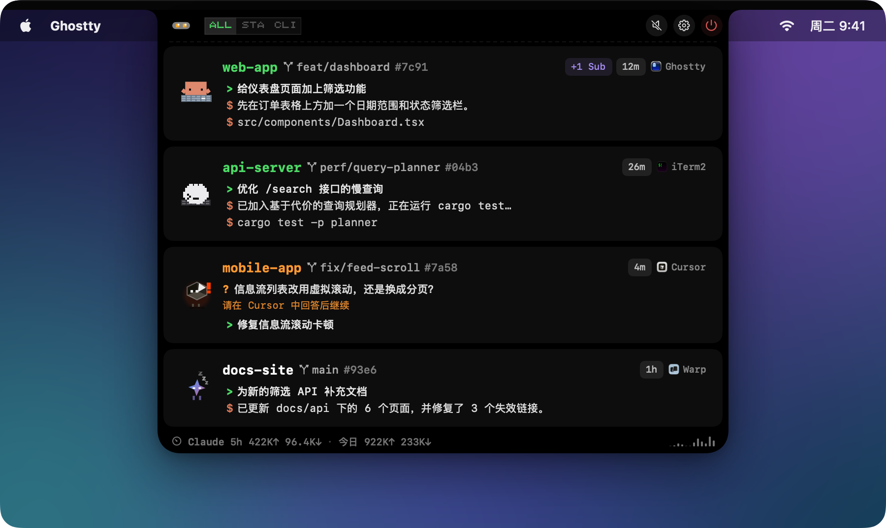
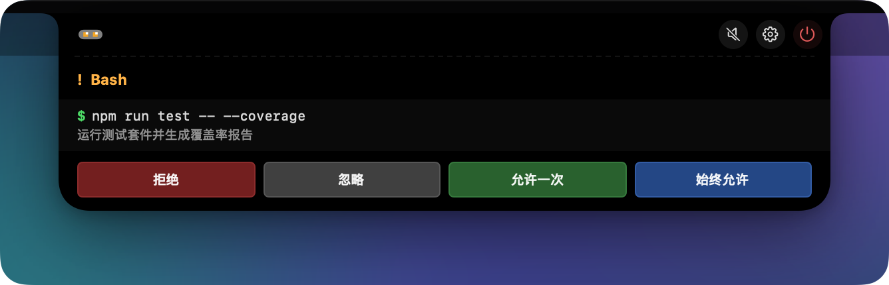
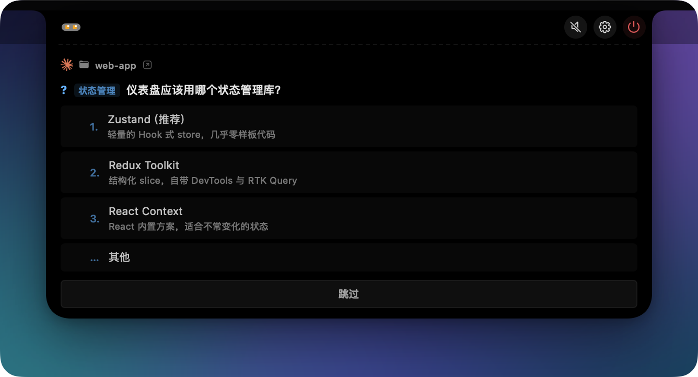

<h1 align="center">
  &nbsp;
  CodeIsland
</h1>

<p align="center">
  <b>把你的 AI 编码 Agent 装进 MacBook 刘海。</b><br>
  每个 Agent 在干什么一眼看清，审批工具调用、回答它的提问，都不用离开当前窗口。
</p>

<p align="center">
  <a href="https://github.com/wxtsky/CodeIsland/releases/latest"></a>
  <a href="https://github.com/wxtsky/CodeIsland/releases"></a>
  
  <a href="https://apps.apple.com/us/app/code-island-buddy/id6773881129"></a>
  <a href="LICENSE"></a>
  <a href="https://github.com/wxtsky/CodeIsland/stargazers"></a>
</p>

<p align="center">
  <a href="#安装">安装</a> •
  <a href="#亮点">亮点</a> •
  <a href="#支持的工具">支持的工具</a> •
  <a href="#工作原理">工作原理</a> •
  <a href="#从源码构建">构建</a>
  <br>
  <a href="README.md">English</a> | <b>简体中文</b>
</p>

<p align="center">
  
</p>

## 为什么需要 CodeIsland？

编码 Agent 大部分时间不是在干活，就是在等你——而你只有切到它的窗口才知道是哪种。CodeIsland 把刘海变成所有 Agent 的实时状态栏：哪个会话在思考、哪个在等审批、哪个刚跑完，一目了然。审批和提问直接在刘海上处理，或者点一下跳到对应的终端标签页。

支持 **30+ 款 AI 编码工具**，hook 自动安装，所有数据留在你的 Mac 上。

## 亮点

<table>
<tr>
<td width="50%" valign="top">

**👀 一眼看清全部**

- 每个会话的状态、当前工具和最新回复，实时更新
- 卡片上显示 Git 分支与 worktree；会话可按项目或工具分组
- Claude 用量统计，以及可选开启的套餐额度（5 小时 / 每周）
- 每个工具一个像素风吉祥物，随 Agent 状态做动作

</td>
<td width="50%" valign="top">

**✋ 不切窗口就能处理**

- 批准、拒绝、始终允许工具调用；回答多问题向导
- 一键跳到对应的终端标签页、IDE 窗口，或 tmux / zellij / Herdr 面板
- 全局快捷键：批准、拒绝、跳过、跳转
- 已开 YOLO / Turbo 模式的 Agent 可设为自动放行

</td>
</tr>
<tr>
<td width="50%" valign="top">

**🧘 不打扰你**

- 智能抑制：你正盯着那个会话的标签页时不提醒
- 静默时段、按事件的 8-bit 音效、「小圆点」完成提示模式
- 全屏时自动隐藏、自动避让菜单栏图标、展开 / 收起速度可调
- 静默规则：指定目录的会话永不打扰

</td>
<td width="50%" valign="top">

**🌐 不止这台 Mac**

- SSH 远程主机：服务器上的会话和本地会话并排显示
- iPhone 与 Apple Watch Buddy：灵动岛、锁屏、StandBy
- 蓝牙连接的 ESP32 桌面小屏
- Webhook 转发到钉钉 / 飞书 / Slack
- 7 种界面语言；签名公证，自动更新

</td>
</tr>
</table>

<p align="center">
  <br>
  <sub>不离开编辑器，直接批准工具调用……</sub>
</p>
<p align="center">
  <br>
  <sub>……或者就在刘海里回答 Agent 的提问。</sub>
</p>

## 支持的工具

<table>
<tr>
<td align="center" width="16%"><br><sub><b>Claude Code</b></sub></td>
<td align="center" width="16%"><br><sub><b>Codex</b></sub></td>
<td align="center" width="16%"><br><sub><b>Gemini CLI</b></sub></td>
<td align="center" width="16%"><br><sub><b>Cursor</b></sub></td>
<td align="center" width="16%"><br><sub><b>Grok CLI</b></sub></td>
<td align="center" width="16%"><br><sub><b>OpenCode</b></sub></td>
</tr>
<tr>
<td align="center"><br><sub><b>Qoder</b></sub></td>
<td align="center"><br><sub><b>Trae</b></sub></td>
<td align="center"><br><sub><b>Copilot CLI</b></sub></td>
<td align="center"><br><sub><b>Factory Droid</b></sub></td>
<td align="center"><br><sub><b>CodeBuddy</b></sub></td>
<td align="center"><br><sub><b>Qwen Code</b></sub></td>
</tr>
<tr>
<td align="center"><br><sub><b>Kimi Code CLI</b></sub></td>
<td align="center"><br><sub><b>Cline</b></sub></td>
<td align="center"><br><sub><b>Pi / Oh My Pi</b></sub></td>
<td align="center"><br><sub><b>Hermes</b></sub></td>
<td align="center"><br><sub><b>OpenClaw</b></sub></td>
<td align="center"><br><sub><b>Google Antigravity</b></sub></td>
</tr>
<tr>
<td align="center"><br><sub><b>Kiro CLI</b></sub></td>
<td align="center"><br><sub><b>StepFun</b></sub></td>
<td align="center"><br><sub><b>WorkBuddy</b></sub></td>
<td align="center"><br><sub><b>DeepSeek Harness</b></sub></td>
<td align="center"><br><sub><b>AiWork</b></sub></td>
<td align="center"><sub><b>+ 更多</b><br>见下方 ↓</sub></td>
</tr>
</table>

**同样支持：** Trae CN、Trae CLI / Trae CLI Next、Qoder CN、QoderWork 与 Qoder CLI、Cursor CLI、CodeBuddy CN、Claude Desktop（Code 标签页）、ZCode。其他使用 Claude 风格 hook 的工具，可以在 设置 → Hooks 里添加为**自定义 CLI**。

**知道它跑在哪：** 运行在 **tmux**、**zellij**、**Herdr** 或 **T3 Code** 里的会话，终端徽标旁会多一个标签，点击跳转会直达对应的面板或线程。

**审批与提问：** hook 会等待决定的工具，都能直接在刘海上批准或回答——Claude Code、Codex、Gemini CLI、Qoder、Qwen Code、Trae CLI Next、ZCode、OpenCode、Pi / Oh My Pi、DeepSeek Harness 等。hook 无法回传决定的工具（Google Antigravity、AiWork）以只读方式显示，审批仍在它们自己的界面里完成。

<details>
<summary><b>各集成安装在哪里</b></summary>

<br>

CodeIsland 启动时会自动写入以下配置，配置被改动时会自动修复；每一项都可以在 **设置 → Hooks** 里单独关闭。

| 工具 | 安装位置 |
|------|----------|
| Claude Code | `~/.claude/settings.json`（遵循 `$CLAUDE_CONFIG_DIR`） |
| Codex | `~/.codex/hooks.json`，[需要审核一次](#codex) |
| Gemini CLI | `~/.gemini/settings.json` |
| Google Antigravity | `~/.gemini/config/hooks.json` |
| Cursor / Cursor CLI | `~/.cursor/hooks.json` |
| Grok CLI | `~/.grok/hooks/codeisland.json` |
| Qoder / Qoder CN / QoderWork | `~/.qoder/`、`~/.qoder-cn/`、`~/.qoderwork/` 下的 `settings.json` |
| Trae / Trae CN | `~/.trae/hooks.json`、`~/.trae-cn/hooks.json`（需在 Trae 里打开全局 Hook） |
| Trae CLI / Trae CLI Next | `~/.trae/traecli.yaml`、`~/.trae/cli/hooks.json` |
| Factory、CodeBuddy、StepFun、WorkBuddy、Qwen Code | `~/.<工具>/settings.json` |
| Copilot CLI | `~/.copilot/hooks/codeisland.json` |
| Kimi Code CLI | `~/.kimi-code/config.toml`（旧版为 `~/.kimi/`） |
| Kiro CLI | `~/.kiro/agents/codeisland.json`，需用 `kiro --agent codeisland` 启动 |
| Hermes | `~/.hermes/config.yaml` |
| ZCode | `~/.zcode/cli/config.json` |
| Cline | `~/Documents/Cline/Hooks` |
| OpenCode | 插件 `~/.config/opencode/plugins/codeisland.js` |
| Pi / Oh My Pi | 扩展 `~/.pi/agent/extensions/codeisland.ts` / `~/.omp/agent/extensions/codeisland.ts` |
| OpenClaw | 插件 `~/.openclaw/codeisland-plugin/` |
| DeepSeek Harness | [dsh-island](https://github.com/cdxiaodong/dsh-island) 插件，见[下文](#deepseek-harness) |
| AiWork | 无需安装，直接读取 AiWork 本机守护进程 |

</details>

## 安装

### Homebrew（推荐）

```bash
brew tap wxtsky/tap
brew install --cask codeisland
```

### 手动下载

1. 从 [最新 Release](https://github.com/wxtsky/CodeIsland/releases/latest) 下载 `CodeIsland.dmg`
2. 把 `CodeIsland.app` 拖进「应用程序」
3. 启动后，会自动为检测到的所有 AI 工具安装 hook

App 已签名并经过 Apple 公证，通过 Sparkle 自动更新。

### iPhone 与 Apple Watch Buddy

<a href="https://apps.apple.com/us/app/code-island-buddy/id6773881129">Code Island Buddy</a> 在 App Store 免费下载，无需账号和服务器。它把 Mac 上的会话同步到灵动岛、锁屏、StandBy 和 Apple Watch，也能直接在手机上审批、回答提问。

1. 在 Mac 上打开 **设置 → Buddy → iPhone Buddy**，勾选「允许 iPhone Buddy 发现这台 Mac」。
2. 在同一 Wi-Fi 下打开 App 完成配对，已连接的设备会列在开关下方。
3. macOS 弹出权限请求时，**本地网络和蓝牙都要允许**。App 在前台时走本地网络传完整快照；退到后台后，靠蓝牙传压缩摘要来刷新实时活动和手表。

companion 源码就在本仓库的 `ios/CodeIslandCompanion` 和 `apple-companion` 目录。

### 硬件桌宠 Buddy（ESP32）

一块通过蓝牙驱动的 ESP32 桌面小屏：Agent 空闲时睡觉，干活时敲键盘，需要你审批或回答时冲你招手。开发板型号、购买参考、固件烧录和配对步骤见 **[hardware/README.md](hardware/README.md)**。Mac 端开关在 **设置 → Buddy**。

## 配置说明

<a name="codex"></a>
<details>
<summary><b>Codex：首次需要信任 hook</b></summary>

<br>

Codex 不会执行没审核过的 hook。安装后启动 Codex，它会提示 `1 hook needs review before it can run.`，运行 `/hooks`，审核并信任 CodeIsland 的条目即可。审核之前 Codex 会静默忽略这些 hook，不报任何错，看起来就像 CodeIsland 不支持 Codex。Codex 会在 `~/.codex/config.toml` 的 `[hooks.state]` 里为每个已信任的 hook 记录内容哈希，所以 CodeIsland 更新后如果改写了 `~/.codex/hooks.json`，需要再审核一次。

Codex 回合进行中、且没有工具在运行时，收起状态的刘海会显示 Agent 最新的公开输出。隐藏推理、加密内容、工具结果和内部子 Agent 消息永远不会显示。

</details>

<details>
<summary><b>OpenCode 1.x 与 2</b></summary>

<br>

OpenCode 通过一个 JS 插件直连 socket，不需要 bridge 程序。同一个插件文件同时支持 OpenCode 1.x（`server()`）和 OpenCode 2（`setup()`），OpenCode 2 会从 `~/.config/opencode/plugins/` 自动加载它。在 OpenCode 2 的共享后台服务模式下，点击跳转只能定位到终端 App、到不了具体标签页；提问通过该服务的本机 HTTP 接口回答。

</details>

<a name="deepseek-harness"></a>
<details>
<summary><b>DeepSeek Harness</b></summary>

<br>

DSH 原生支持插件，CodeIsland 不需要安装任何 hook。[dsh-island](https://github.com/cdxiaodong/dsh-island) 插件会监听 DSH 的内置事件并写入 CodeIsland 的 socket：

```bash
dsh plugin --profile <profile> add github:cdxiaodong/dsh-island
```

</details>

<details>
<summary><b>Google Antigravity</b></summary>

<br>

Antigravity 的 `PreToolUse` hook 只能拒绝工具调用、不能批准，所以刘海对 Antigravity 只做**观察**：显示正在运行的工具，每一次决定都交还给 Antigravity 自己的权限弹窗，你设置的授权和「始终允许」照常生效。

</details>

<details>
<summary><b>SSH 远程主机</b></summary>

<br>

在 **设置 → 远程** 添加主机。CodeIsland 会在服务器上安装一个小助手和 hook（合并进你现有的配置，不会覆盖），并通过 SSH 把事件转发回来。可选的「工作目录过滤」能在共享服务器上挡掉别人的会话。某个工具显示 `skipped` 时，状态行会写明原因，通常是那台主机上还没有它的配置目录。

</details>

## 工作原理

```
AI 工具（Claude Code / Codex / Gemini / Cursor / …）
  └─ 触发 hook ─→ codeisland-bridge（原生 Swift 小程序）
                    └─ Unix socket /tmp/codeisland-<uid>.sock
                         └─ CodeIsland 实时更新刘海
                              └─ 可选：iPhone / Watch / ESP32 Buddy、Webhook
```

CodeIsland 往每个工具自己的配置里装一个轻量 hook。工具触发事件时（会话开始、工具调用、权限请求、提问、结束），bridge 把事件以 JSON 形式经本机 Unix socket 转发过来，刘海立即更新。需要你做决定的事件，答案也沿同一条路回传。

**隐私：** 除非你主动开启，事件不会离开你的 Mac。CodeIsland 发出的网络请求只有：Sparkle 更新检查；以及仅在你打开时才有的 Claude 套餐额度查询（用你自己的 Claude Code 登录请求 `api.anthropic.com`）和发往你所配置地址的 Webhook 转发。

## 设置

| 页面 | 内容 |
|------|------|
| **通用** | 语言、开机启动、显示器选择 |
| **行为** | 自动展开、智能抑制、完成提示方式、会话清理、静默规则、自动放行、Webhook |
| **外观** | 面板尺寸、刘海宽度、字号、回复行数、展开 / 收起速度、Git 分支、用量统计、套餐额度 |
| **角色** | 预览所有像素角色和它们的动画 |
| **声音** | 按事件的 8-bit 音效、音量、静默时段 |
| **快捷键** | 全局快捷键：开关面板、批准、拒绝、始终允许、跳过、跳转 |
| **远程** | SSH 主机及每台主机的目录过滤 |
| **Hooks** | 各工具安装状态、重新安装 / 卸载、自定义 CLI |
| **Buddy** | iPhone / Apple Watch 配对、ESP32 硬件桌宠 |
| **关于** | 版本、检查更新、导出诊断信息 |

### 键盘快捷键

| 快捷键 | 功能 | 默认 |
|--------|------|------|
| <kbd>⌘</kbd><kbd>⇧</kbd><kbd>I</kbd> | 展开 / 收起灵动岛 | 开启 |
| <kbd>⌘</kbd><kbd>⇧</kbd><kbd>A</kbd> | 批准当前显示的请求 | 关闭 |
| <kbd>⌘</kbd><kbd>⇧</kbd><kbd>D</kbd> | 拒绝当前显示的请求 | 关闭 |

所有快捷键都可以在 **设置 → 快捷键** 里改绑，还能给「始终允许」「跳过问题」「跳转到终端」绑定快捷键。启用后的批准 / 拒绝快捷键会以角标形式显示在审批卡片上。

## 从源码构建

需要 **macOS 14+** 和 **Swift 5.9+**。

```bash
git clone https://github.com/wxtsky/CodeIsland.git
cd CodeIsland

# 开发：debug 构建并启动（Buddy 蓝牙需要用下面打包出的 .app）
swift build && ./.build/debug/CodeIsland

# 发布：通用二进制（Apple Silicon + Intel）
./build.sh
open .build/release/CodeIsland.app

# 测试
swift test
```

## 系统要求

- macOS 14 Sonoma 或更高版本
- 带刘海的 MacBook 体验最佳；外接显示器和无刘海屏幕也能用

## 致谢

灵感来自 [@farouqaldori](https://github.com/farouqaldori) 的 [claude-island](https://github.com/farouqaldori/claude-island)，感谢把 AI Agent 状态放进 macOS 刘海这个最初的想法。也感谢所有贡献集成、修复和问题反馈的朋友。

## Star History

<a href="https://star-history.dera.page/#wxtsky/CodeIsland&type=date&legend=bottom-right">
  <picture>
    <source media="(prefers-color-scheme: dark)" srcset="https://star-history.dera.page/svg?repos=wxtsky/CodeIsland&type=date&theme=dark&legend=top-left" />
    <source media="(prefers-color-scheme: light)" srcset="https://star-history.dera.page/svg?repos=wxtsky/CodeIsland&type=date&legend=top-left" />
    
  </picture>
</a>

## 许可证

MIT，详见 [LICENSE](LICENSE)。
